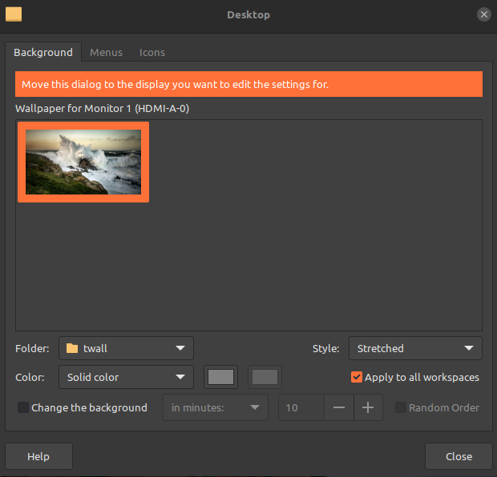

# The Random Wallpaper Bash Script (rwallpaper)
Set the <ins><b>same</b></ins> random wallpaper on multiple monitors without any "fancy" app. The script was successfully tested using [Linux Mint 21.1 Xfce Edition](https://linuxmint.com/rel_vera_xfce_whatsnew.php). For a set of awesome wallpapers, I suggest those available [here](https://gitlab.com/dwt1/wallpapers).

# How to Install
1. Clone this repository and change to its directory:
```
$ git clone https://github.com/tiagomiguelcs/random-wallpaper.git
$ cd random-wallpaper
```
2. In the script, set the ``path`` variable to the wallpapers' directory:
```
path=~/Pictures/wallpapers/ 
```
3. Run the script
```
./rwallpaper
```
4. In your desktop settings, set the wallpaper to the one defined in the script (e.g., ``~/Pictures/twall/today.jpg``)

5. Add the following line to your ``.profile`` file in order to set a random wallpaper each time you login (don't forget to replace ``path_to_repo`` with the actual path of the repo):
```
~/[path_to_repo]/rwallpaper
```
6. Enjoy!
